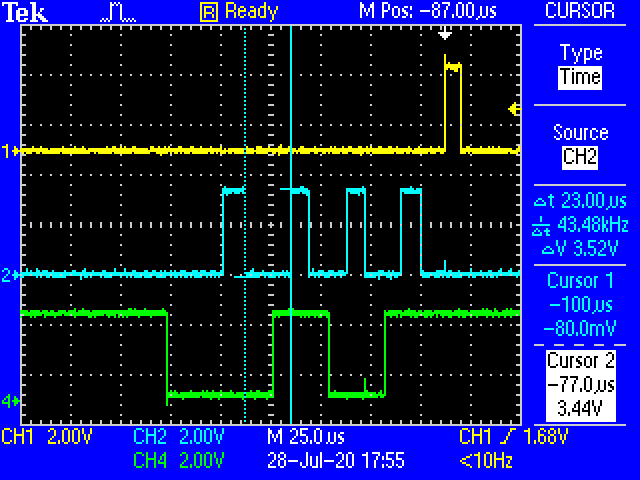

# ShiftRegister

Demonstration of using a 74HC595 output shift register in Elixir/Nerves. An
explanation is available in the video [Take Flight With Elixir](https://youtu.be/4Qxg48HkJGo)
starting at timestamp [27:00](https://youtu.be/4Qxg48HkJGo?t=1620).

## GPIO Waveforms

### Timing

### Unpredictability

## SPI Waveforms

